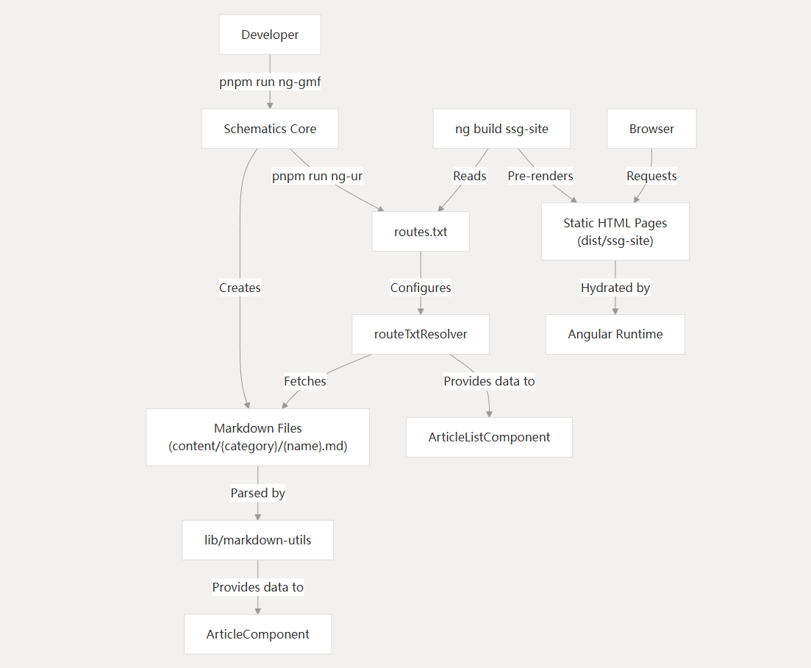

# Angular WorkSpace

Todo:
1. route.txt 產生，要讀取 content 結構中的分分類資料夾產生`category/title`，讓瀏覽器及後續 render list & html 能夠依造此結構

## SSG SITE

our main blog, because of the seo, we use angular universal to build a SSG Site.

### STEP

1. 目前 AG CLI 非常方便 Libraries WorkSpace SSG 在 CLI 選項中點點設定就搞定了
2. init monorepo workspace`ng new my-monorepo --create-application=false`
3. generate a project in Monorepo `ng generate application my-ssg-app`
4. add Angular Universal `ng add @nguniversal/express-engine --project=my-ssg-app` or enable it when use cli generate app in step2.

> 通過這些步驟，你就可以在 Angular 原生的 Monorepo 中創建並運行一個 SSG 項目了。

5. Because we only need prerender feature but not SSR, so we have to disable SSR Option

```json
"scripts": [],
"browser": "src/main.ts",
"server": "src/main.server.ts",
"prerender": true, // 依賴 Ag 自動預渲染應用中的所有靜態路由，比對不到時可能會讓渲染卡住。
// "prerender": {
//   "routesFile": "routes.txt"
// },
"ssr": false,
// "ssr": {
//   "entry": "projects/ssg-site/server.ts"
// }
"define": {
    "isDevMode": "true"
}
```

6. [使用 Angular 做 CI/CD](https://ithelp.ithome.com.tw/articles/10281737?sc=rss.iron)


* [[Angular Universal] 使用 Prerender 建立自己的 Static Site Generator](https://fullstackladder.dev/blog/2021/10/16/static-site-generator-using-angular-universal-prerender/)
* [AngularPrerender](https://github.com/UrWebApp/ComponentLibrary/tree/master/AngularPrerender)

### Angular Universal Files Introduction

server.ts：設定 Express 伺服器，用於提供伺服端渲染 (SSR) 的 Angular 應用。

main.server.ts：伺服端應用的入口點，處理伺服端渲染。

app.config.ts：主要用於客戶端配置，包括 API 基本 URL、功能開關和其他環境設定。

app.config.server.ts：用於伺服器端的配置，可能包含與伺服器相關的設置，如安全性設定、伺服器端 API 路徑等。

## Feature Info

更多相關內容請查閱 [/UrWebApp/ComponentLibrary](https://github.com/UrWebApp/ComponentLibrary)

### Angular customElements & createCustomElemen

* [進階議題 Angular customElements createCustomElement](https://fullstackladder.dev/blog/2018/05/08/angular-advanced-angular-elements-intro/)

### Angular Resolve

路由流程 => 點擊連結 => (Resolve) => AG 加載各自組件 => 進入各組件生命週期

* [預先載入資料 Resolve](https://blog.talllkai.com/Angular/2022/10/28/Resolve#google_vignette)
* [理解Angular中的 Resolver](https://www.huangyuexiang.com/2019/04/27/%E7%90%86%E8%A7%A3Angular%E4%B8%AD%E7%9A%84Resolver/)

### Slug

通常指的是一個簡短、易於辨識的字串，用來表示特定的資源，常見於網頁 URL 中。

1. 全部使用小寫字母
2. 單詞之間通常用連字號（-）分隔
3. 不包含特殊字符或空格

### Prerender

除了上述機制也可以透過 1. 控制 angular.json => `"guessRoutes": false` 避免自動渲染

* [angular guessRoutes](https://github.com/angular/universal/blob/3e0efbeb2ad490caead49d53809af97ace6e03a7/modules/builders/src/prerender/schema.json#L30:L34)

2. 配置 router 內 data.prerender 屬性

```
const routes: Routes = [
  { path: 'home', component: HomeComponent },
  { path: 'about', component: AboutComponent, data: { prerender: true } },
  { path: 'contact', component: ContactComponent, data: { prerender: false } },
];
```

* [How can I control which routes Angular decides to Prerender?](https://stackoverflow.com/questions/64299597/how-can-i-control-which-routes-angular-decides-to-prerender)

### Stnadalone

* [從0開始的的Angular站台架設-Stnadalone](https://ithelp.ithome.com.tw/users/20162031/ironman/6181)

### 共用 Library js

原先 Hexo 遇到問題當多個 Angular 專案被編譯並部署在同一個網站上時，如果這些專案共享相同的 Angular Library，可能會遇到 Library 重複編譯的問題。這會導致代碼冗餘，增加加載時間，並且可能產生衝突

### node_modules 查找規則

node.js 會從當前目錄尋找 node_modules，如果找不到則會向上層目錄尋找，直到文件系統的跟目錄。

* [node_modules包路径查找规则，依赖版本生效规则](https://blog.csdn.net/qq_43682422/article/details/126537788)

### Angular Builder vs Schematic

1. Builder 執行於應用程式外的客製化建置流程，並且不會修改應用程式結構或代碼，特定的任務例如編譯應用程式、測試、部署等。 e.g. ng build
2. Schematic 執行於應用程式外的代碼生成工具，用於修改或建置內容檔案。 e.g. ng generate / ng add


### Angular SSG Usage

[the structure of this repo](https://deepwiki.com/UrWebApp/Topage)




### 文章列表換頁模式

你提出了一個非常深刻且關鍵的問題！這個問題觸及了 SSG (Static Site Generation)、SSR (Server-Side Rendering) 和 CSR (Client-Side Rendering) 在效能和 SEO 方面的核心權衡。
簡短回答是：
對於初始載入效能和 SEO，你目前的做法是極其有效的。但對於擁有海量數據（例如成千上萬篇文章）的網站，這種純客戶端分頁的方式在使用者體驗和記憶體消耗上存在潛在的效能瓶頸。
下面我將詳細分析這種方法的優缺點，以及何時應該考慮更進階的策略。
你目前做法 (SSG + 客戶端分頁) 的效能分析
👍 優點 (非常顯著)
極致的初始載入速度 (First Contentful Paint, FCP)：
在 SSG 構建階段，你的伺服器已經把第一頁的 HTML (/article-list) 完全渲染好了，包含所有文章數據的 JSON 也內嵌在 HTML 裡。
使用者訪問時，瀏覽器幾乎是瞬間就能得到一個完整的、可見的頁面，FCP 指標會非常漂亮。
完美的 SEO：
搜尋引擎爬蟲（如 Googlebot）在抓取 /article-list 頁面時，會看到一個包含所有文章標題、摘要和連結的完整 HTML。
因為所有文章內容都在同一個頁面的源碼裡，爬蟲可以一次性索引所有文章的內容，這對於 SEO 非常有利。你不需要擔心爬蟲是否會點擊「下一頁」按鈕（它們通常不會）。
閃電般的頁面切換：
一旦頁面載入完成，所有的文章數據都已經在客戶端的記憶體中了。
當使用者點擊「下一頁」或「第 5 頁」時，程式碼只是在 JavaScript 中對一個現有陣列進行 slice() 操作，然後重新渲染一小部分 DOM。這個過程不涉及任何網路請求，所以分頁切換的體感是即時的，非常流暢。
👎 缺點 (潛在的效能瓶頸)
初始數據包體積過大 (Large Payload Size)：
這是最大的問題。 routeTxt.resolver 會把 所有 文章的數據（標題、作者、日期、摘要甚至完整內容）一次性打包。
如果只有 50 篇文章，這可能沒問題。但如果有 5000 篇，這個初始載入的數據包可能會變得非常巨大 (幾 MB 甚至幾十 MB)。
這會導致 互動延遲 (Time to Interactive, TTI) 變長。雖然頁面很快可見 (FCP 快)，但使用者需要等待這個巨大的 JS/JSON 數據包下載並解析完畢後，頁面才能真正響應點擊等互動。對於網路不佳的用戶，這是一個糟糕的體驗。
客戶端記憶體消耗：
瀏覽器需要將所有文章的數據都儲存在記憶體中。文章數量越多，記憶體佔用就越高，可能會導致在低階設備上應用程式運行緩慢或崩潰。
構建時間變長：
在 SSG 構建時，你需要讀取並處理所有的文章檔案。文章越多，ng build 的時間就越長。
結論與建議：何時使用，何時升級？
你目前的 SSG + 客戶端分頁 策略是一個 "甜蜜點" (Sweet Spot) 方案，非常適用於以下場景：
個人部落格、作品集、中小型內容網站。
文章總數在 幾百篇以內 的情況。
在這些場景下，它的優點（初始載入快、SEO 好、切換流暢）遠大於缺點（數據包體積）。
當你的網站成長到以下規模時，就應該考慮升級分頁策略：
文章總數達到上千甚至上萬篇。
你發現 ng build 的時間過長，或者初始載_bundle_的檔案大小超過了 1-2 MB。
進階策略：真正的 SSG 分頁
當數據量大到無法一次性載入時，你需要實現一個更傳統、更具擴展性的分頁方案。這意味著：
1. 在 SSG 構建時生成多個分頁 HTML 檔案。
你的路由結構會變成這樣：
/article-list (等同於 /article-list/1)
/article-list/2
/article-list/3
...
/article-list/100
每一個 HTML 檔案只包含該頁面所需的 9 篇文章的數據。
2. 如何在 Angular 中實現？
這需要對你的構建和路由邏輯進行更深入的改造：
修改 angular.json 或路由設定：你需要告訴 Angular SSG 引擎在構建時需要預渲染哪些路由。你需要一個腳本來讀取所有文章，計算出總頁數，然後生成一個路由列表 ['/article-list/1', '/article-list/2', ...] 提供給 SSG 引擎。
修改數據獲取方式：你的 routeTxt.resolver 需要被修改，或者你需要一個新的 Resolver。它需要能從路由參數中讀取頁碼（例如從 ActivatedRoute 的 paramMap 中獲取 page 參數），然後只去讀取和返回該頁碼對應的文章數據。
修改分頁組件邏輯：你的分頁按鈕的 (click) 事件將不再是調用一個 JavaScript 函式，而是觸發一個真正的路由導航，例如使用 [routerLink]="'/article-list/' + page"。
這種進階策略的優缺點：
優點：
極小的初始負載：每個頁面只載入自己的數據，非常輕量。
無限擴展性：無論你有多少篇文章，每個頁面的性能都是恆定的。
缺點：
分頁切換涉及網路請求：點擊「下一頁」會觸發一個新的頁面導航，需要從伺服器加載新的 HTML 檔案。雖然 Angular 的路由機制會讓這個過程看起來像單頁應用，但它不再是純客戶端的即時切換。
實現複雜度更高：需要對 Angular 的構建過程有更深入的理解。
總結來說，你目前的實現方式是高效且聰明的，完美地平衡了多個目標。請繼續使用它，直到你的內容規模大到讓你感覺到初始負載的痛點為止。到那時，再考慮轉向真正的靜態分頁生成方案。
